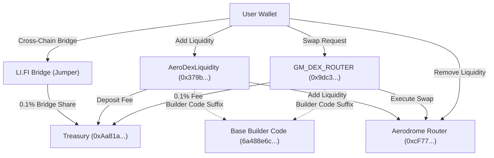

# ☀️ GM DEX — Decentralized Exchange & Liquidity Protocol on Base

> High-performance DEX, Liquidity Pools, and Cross-Chain Asset Bridge built on **Base Mainnet**, powered by Aerodrome V2 liquidity routing, automated protocol fee collection, and Base Builder Code attribution.

---

## 🌟 Key Features

- 🔄 **Token Swap Landing Dashboard** — Swap ETH, USDC, EURC, and more with zero slippage loss, sub-second finality, and 0.1% protocol fee collection directly to Treasury.
- 💧 **XyloNet Pools Landing Page** — Provide liquidity to Aerodrome pools (`USDC/EURC`, `ETH/USDC`, `ETH/EURC`) with real-time LP position tracking, pool share percentage calculation, and automated deposit fee collection.
- 🌉 **Multi-Chain Asset Bridge** — Integrated LI.FI / Jumper cross-chain bridge supporting 15+ EVM chains & Solana to Base Mainnet, with a 0.1% protocol fee routed to Treasury.
- ⚡ **Ultra-Fast Balance Polling** — 2-second background auto-refetching for wallet balances, token allowances, and LP token holdings.
- 🏷️ **Base Builder Code Attribution** — ERC-8021 standard transaction data suffix (`6a488e6c2876ee6c1138a856`) appended to all swaps and liquidity deposits for Coinbase Builder Rewards.
- 🎨 **XyloNet Aesthetic** — Slate blue (`#0f172a`), mint green (`#01C38E`), and deep teal (`#0A786A`) glassmorphism dark theme.

---

## 📜 Deployed Smart Contracts (Base Mainnet - Chain ID: 8453)

| Contract / Address | Type | Role & Description |
| :--- | :--- | :--- |
| **`0x9dc3BBdB8817309ba42b79cc357EC6Be47030B70`** | `GMDexRouter` | **Swap Fee Router** — Collects 0.1% swap fee to Treasury and routes remaining swap to Aerodrome Router. |
| **`0x379bB6CBd151c8A9C3da6e534E46356e17b14572`** | `AeroDexLiquidity` | **Liquidity Deposit Fee Router** — Collects deposit fee to Treasury and deposits liquidity into Aerodrome pools. |
| **`0xcF77a3Ba9A5CA399B7c97c74d54e5b1Beb874E43`** | `AeroRouter` | **Aerodrome V2 Router** — Used for price quote queries, reserve ratios, and LP token withdrawals. |
| **`0x420DD381b31aEf6683db6B902084cB0FFECe40Da`** | `AeroFactory` | **Aerodrome Pool Factory** — Returns LP token addresses for pool reserve queries and balance tracking. |
| **`0xAa81a036Bf5a2823dAA2Aadbcc66140fAb29CcE9`** | `Treasury` | **Protocol Treasury Wallet** — Receives all collected swap fees, deposit fees, and bridge fee shares. |

---

## 🏛️ System Architecture & Data Flow



---

## 🛠️ Technology Stack

- **Core Framework**: [Next.js 16](https://nextjs.org) (App Router, Turbopack)
- **Web3 Libraries**: [Wagmi v2](https://wagmi.sh) + [Viem](https://viem.sh)
- **Smart Contracts**: Solidity ^0.8.20, Hardhat, OpenZeppelin
- **Liquidity & Routing**: Aerodrome V2 (Base Mainnet)
- **Cross-Chain Bridge**: LI.FI / Jumper Exchange Embed
- **Styling**: Tailwind CSS v4 + Lucide React Icons
- **Target Blockchain**: [Base Mainnet](https://base.org) (Chain ID: 8453)

---

## 🚀 Local Development Setup

### 1. Clone & Install Dependencies

```bash
git clone https://github.com/earnadvise/gm-dex.git
cd gm-dex
npm install
```

### 2. Configure Environment Variables (`.env.local`)

```env
NEXT_PUBLIC_RPC_URL=https://mainnet.base.org
NEXT_PUBLIC_BUILDER_CODE=6a488e6c2876ee6c1138a856
```

### 3. Run Development Server

```bash
npm run dev
```

Open [http://localhost:3000](http://localhost:3000) to view the application locally.

---

## 📄 License

MIT
